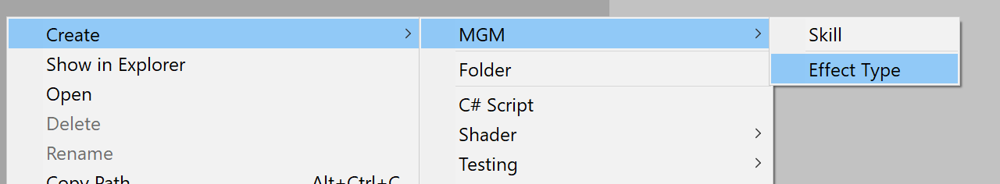

# Declaring a new Effect Type

Note : The code snipet explained below are generated in a single file through the 'Create > MGM > Effect Type' menu.
You only need to update the parts of the file where there is a '// YOUR CODE : ' comment.
There should be no reason fo you to edit the generated code. (except for the NAMESPACE)




## The effect declaration
```C#
	public struct NewEffect : IEffect
    {
        // YOUR CODE : delcare all necesasry data inherant to the effect consumption, could be a the effect power, damage type,...

		

        // Mandatory for Authoring, do not edit
        public void Convert(Entity entity, EntityManager dstManager, int skillIndex)
        {
            EffectUtility.AddEffect<NewEffectBuffer, NewEffect>(entity, dstManager, skillIndex, this);
        }
    }
```
This struct contains all the data ncessary to define the skill. It may be the power of the skill, the type of damage it deals and so on.
The "Convert" method is used by the converion system to register the effect in the appropriate buffer on the entity.
This is delageted to the struct because it allow the conversion code to not be dependant on the type of effect it handles. 


## The effect buffer
```C#
    // Mandatory for Authoring, do not edit
    public struct NewEffectBuffer : IEffectBufferElement<NewEffect>
    {
        public int SkillIndex { get; set; }
        public NewEffect Effect { get; set; }
    }
```
To store all the effect that can be trigerred by an entity at runtime MGM Skill uses a dynamic buffer for each effect type.
So when you declare a new effect, we need to declare the associated buffer to store the effects and the index of hte skill they belongs to.


## The effect context
```C#
    public struct NewEffectContext : IEffectContext<NewEffect>
    {
        // YOUR CODE : delcare all necesasry contextual data for the effect consumption, could be a position, attack power,...
        
        // Mandatory for Authoring, do not edit
        public Entity Target { get; set; }
        public NewEffect Effect { get; set; }
    }
```
When trigerring an effect, the effect is written to a native stream allog with the targeted entity.
The effect and target are the minimal parameters for any effect trigger.
Additionnaly, you can add context data specific to the event type you are declaring.
Generaly speaking this additional context it the data belonging to the caster and that affect the effect application like it's position or attack power.


## The trigger system
```C#
	[UpdateBefore(typeof(NewEffectConsumerSystem))]
    public class NewEffectTriggerSystem : EffectTriggerSystem<NewEffectBuffer, NewEffect, NewEffectConsumerSystem, NewEffectTriggerSystem.TargetEffectWriter, NewEffectContext>
    {

        [BurstCompile]
        public struct TargetEffectWriter : IEffectContextWriter<NewEffect>
        {
			// YOUR CODE : declare the public [ReadOnly] component data chunk accessor and the private [ReadOnly] native array to cache the component data

            /// <summary>
            /// Cache the component data array needed to write the effect context.
            /// </summary>
            /// <param name="chunk"></param>
            public void PrepareChunk(ArchetypeChunk chunk)
            {
                // YOUR CODE : cache the component data array in a private [ReadOnly] field on the struct
            }

            /// <summary>
            /// Write the contextualized effect to it's corresponding consumer stream.
            /// </summary>
            /// <param name="entityIndex">The casting entity.</param>
            /// <param name="consumerWriter">The corresponding effect consumer stream.</param>
            /// <param name="effect">The effect to contextualize.</param>
            public void WriteContextualizedEffect(int entityIndex, ref NativeStream.Writer consumerWriter, NewEffect effect, Entity target)
            {
				                consumerWriter.Write(new NewEffectContext() {
                    Target = target,
                    Effect = effect
                    // YOUR CODE : populate the effect context with additonal contextual data.
                });
			}
        }


        protected override TargetEffectWriter GetContextWriter()
        {
            return new TargetEffectWriter()
            {
             	// YOUR CODE : populate the component data chunk accessor
            };
        }

		/* Optional
        protected override EntityQueryDesc GetEffectContextEntityQueryDesc()
        {
            return new EntityQueryDesc()
            {
                All = new ComponentType[]
                {
                     // YOUR CODE : declare all required component type for populating the context of the effect.
                }
            };
        }
		*/
    }
```
The trigger system is a class extending EffectTriggerSystem that is in charge of writing the trigerred effect and there context to the native stream.
Your system's goal is to create and populate the effect context before writing it to the native stream.
This is done though a struct implementing IEffectContextWriter.
This iterface declare two method one for caching the component data array of the entity chunks (PrepareChunk), one to accualy write the context(WriteContextualizedEffect). 
The logic shared by all effect trigger system is handled by the base EffectTriggerSystem. 
It will take care of checking which skill are active, which target are affected and ensure the that the trigger job finishes before the consumer jib start.
Then for each active skill and target it will call the WriteContextualizedEffect method.

The necessary component data chunk accessor need to be declared when creating the writer struct.
This is done in the GetContextWriter method. This method is called by the base class whenever the trigger job contained within it is scheduled. 

If you don't need additional context data for your effect, you have noting to change.
If you need additional data, let's say the position, you need to declare the necessary component data on hte entity in the GetEffectContextEntityQueryDesc method.

## The consumer system
```C#
  [UpdateAfter(typeof(NewEffectTriggerSystem))]
    public class NewEffectConsumerSystem : EffectConsumerSystem<NewEffect, NewEffectContext>
    {
        protected override void Consume()
        {
            NativeMultiHashMap<Entity, NewEffectContext> effects = Effects;
            Entities.WithReadOnly(effects).ForEach((ref Entity targetEntity/* YOUR CODE : component on the target that are nedded to apply the effect*/) =>
            {
                NativeMultiHashMap<Entity, NewEffectContext>.Enumerator effectEnumerator = effects.GetValuesForKey(targetEntity);

     
                while (effectEnumerator.MoveNext())
                {
                    // YOUR CODE : Consume the effect
                }

            }).WithBurst()
            .ScheduleParallel();
        }
    }
```
The consumer system is where you declare the actual impact of the effect on the targeted entity.
For performance reason, you don't have access to the native stream you wrote to in the trigger system, you are instead provided with a nativemultihashmapp where the key is the targeted entity.
That mapping is done by the base implementation of the EffectConsumerSystem.
Your system need to iterated over all the entity that could potentially be affected by the effect (matching all component data necessary to aply the effect).
Then for each iteration of the job, you check if the entity currently porcessed is targetd by the effect. If so you iterate and apply all the effect affecting this entity.

